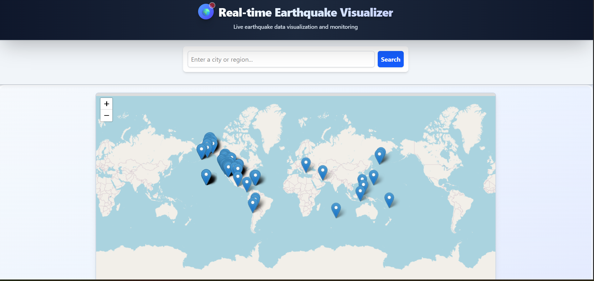

# Real-time Earthquake Visualizer 🌎



This project is a responsive web application built with React that visualizes recent earthquake activity from around the world on an interactive map. It fetches real-time data from the U.S. Geological Survey (USGS) and allows users to search for specific locations to see nearby seismic events.

This tool is perfect for students, enthusiasts, or anyone curious about global seismic patterns.

---

## ✨ Features

-   ✅ **Real-time Data**: Fetches and displays earthquake data for the past 24 hours from the USGS GeoJSON feed.
-   ✅ **Interactive Map**: Uses Leaflet and React-Leaflet to render a pannable and zoomable world map.
-   ✅ **Dynamic Markers**: Earthquake markers are color-coded based on magnitude and display the magnitude value directly on the map.
-   ✅ **Location Search**: Users can search for any city or location to re-center the map and explore local seismic activity.
-   ✅ **Detailed Popups**: Clicking on a marker reveals a popup with detailed information, including location, magnitude, time, and a link to the official USGS event page.
-   ✅ **Responsive Design**: The UI is fully responsive and works seamlessly on desktop, tablet, and mobile devices, thanks to Tailwind CSS.

---

## 🛠️ Tech Stack

-   **Frontend**: [React](https://reactjs.org/) (via [Vite](https://vitejs.dev/))
-   **Mapping**: [Leaflet](https://leafletjs.com/) & [React-Leaflet](https://react-leaflet.js.org/)
-   **Styling**: [Tailwind CSS](https://tailwindcss.com/)
-   **APIs**:
    -   [USGS Earthquake API](https://earthquake.usgs.gov/earthquakes/feed/v1.0/geojson.php) for seismic data.
    -   [OpenStreetMap Nominatim](https://nominatim.openstreetmap.org/) for geocoding search queries.

---

## 🚀 Getting Started

Follow these instructions to get a local copy of the project up and running on your machine.

### Prerequisites

You need to have [Node.js](https://nodejs.org/) (version 16 or later) and `npm` installed.

### Installation

1.  **Clone the repository:**
    ```bash
    git clone [https://github.com/your-username/earthquake-visualizer.git](https://github.com/your-username/earthquake-visualizer.git)
    cd earthquake-visualizer
    ```

2.  **Install NPM packages:**
    ```bash
    npm install
    ```

3.  **Run the development server:**
    ```bash
    npm run dev
    ```

The application will now be running on `http://localhost:5173` (or the next available port).

---

## 📂 Project Structure

The project is organized into three main components as requested:

```
src/
├
├── EarthquakeMap.jsx   # Renders the Leaflet map and earthquake markers.
└── Earthquakesearch.jsx       # Provides the location search input and button.
├── App.jsx              # Main application component, manages state and API calls.
├── index.css            # Global styles and Tailwind CSS directives.
└── main.jsx             # Entry point of the React application.
```

-   `App.jsx`: The "brain" of the application. It fetches the earthquake data, holds the application state (earthquakes, map center), and passes data and functions down to its children.
-   `Earthquakesearch.jsx`: A simple, controlled component that lifts its state (the search query) up to `App.jsx` for processing.
-   `EarthquakeMap.jsx`: The core visualization component. It receives data as props and is responsible for rendering the map tiles and markers.

---

## 📝 Notes & Key Concepts

### Map Recenter Logic

The `MapContainer` component from `react-leaflet` does not automatically re-center when its `center` prop changes after the initial render. To solve this, we use a small helper component, `ChangeView`, inside `MapDisplay.jsx`:

```jsx
function ChangeView({ center, zoom }) {
  const map = useMap();
  map.setView(center, zoom);
  return null;
}
```

This component uses the `useMap()` hook to get access to the Leaflet map instance and programmatically calls `map.setView()` whenever the `center` prop (passed down from `App.jsx`) is updated.

### Custom Markers with `L.divIcon`

Instead of using a static image for map markers, we use Leaflet's `L.divIcon`. This allows us to create markers using HTML and CSS. This approach has several advantages:

-   **Dynamic Content**: We can display the earthquake's magnitude (`properties.mag`) directly inside the marker.
-   **CSS Styling**: The markers are styled with Tailwind CSS classes for color (based on magnitude), size, and shape, making them highly customizable.
-   **Performance**: Using `div` elements can be more efficient than rendering many image files.

---

## 🚀 Future Improvements

This project serves as a solid foundation. Here are some ideas for future enhancements:

-   **Date & Magnitude Filtering**: Add UI controls to filter earthquakes by a date range or a minimum/maximum magnitude.
-   **Data Visualization**: Implement a sidebar that lists the recent earthquakes. Clicking an item on the list would pan the map to that earthquake's location.
-   **Loading Skeletons**: Show a skeleton UI for the map container while the initial data is being fetched for a better user experience.
-   **Advanced Error Handling**: Display more user-friendly error messages (e.g., using toast notifications) if an API fails.
-   **WebSockets**: For true real-time updates, connect to a WebSocket feed from USGS to see new earthquakes appear on the map without needing to refresh the page.

---

## 🙏 Acknowledgements

-   Data provided by the [U.S. Geological Survey (USGS)](https://www.usgs.gov/).
-   Map tiles provided by [OpenStreetMap](https://www.openstreetmap.org/).

---

## 📄 License

This project is licensed under the MIT License. See the `LICENSE` file for details.
